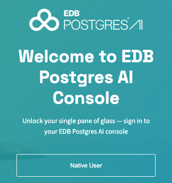
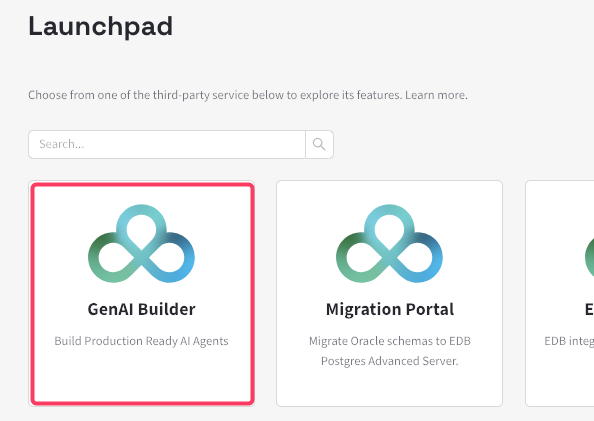
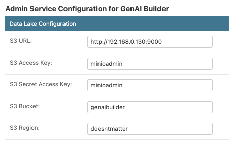
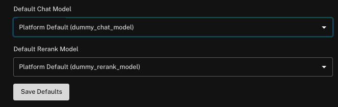

# Hybrid Manager on kind
The code in this repository is used to deploy the [Hybrid Manager](https://www.enterprisedb.com/docs/edb-postgres-ai/hybrid-manager/) to a `kind` Kubernetes cluster.

> [!IMPORTANT]
> THIS README.md IS OUT OF DATE!!!


## Prerequisites
- Docker. I use Docker Desktop for Mac, but plain docker or podman work as well.
- I assigned **12 cores** and **16Gb of memory** to Docker.
- A recent version of kind (https://kind.sigs.k8s.io/)
- Make sure you have your `.edb_subscription_token` in your `$HOME/tokens` directory.

> [!IMPORTANT]
> Since you are going to use `kind` (Kubernetes in Docker), make sure that you DON'T run Kubernetes in Docker for Desktop. 
> Deployment will fail if you do.


This demo will deploy 1 Kubernetes control plane node and 3 worker nodes.

If you are using an ARM computer, please add the GenAI Builder to the `disabledComponents` section in the `kind-values.yaml` file like so:
```
disabledComponents:
- upm-griptape
```
We are actively working on building GenAI Builder binaries for the ARM platform.

## Installation of the Hybrid Manager
As usual, to provision this demo environment, just run the `00-provision.sh` script. This will install the latest version of the Hybrid Manager. Currently this is v1.2.3

`00-provision.sh` will also deploy a Minio container. This container is used for the GenAI Builder.

Default credentials for the Minio container are:
URL: [http://localhost:9001](http://localhost:9001)

Userid: `minioadmin`

Password: `minioadmin`

## After installation steps
### Log in to the platform


Once installation is done, you can access the Hybrid Manager on [https://localhost:8000](https://localhost:8000)

Userid: `owner@mycompany.com`

Password: `password`

### How to connect to a deployed cluster
Once you deploy your first cluster, a namespace and various pods will be created.
```
kubectl get pods -n p-m1grhxxddy 
NAME             READY   STATUS    RESTARTS   AGE
p-m1grhxxddy-1   3/3     Running   0          27m
```
To connect to the pod there are two methods:
1. Use kubernetes port-forwarding
```
kubectl port-forward -n p-m1grhxxddy p-m1grhxxddy-1 5432:5432
Forwarding from 127.0.0.1:5432 -> 5432
Forwarding from [::1]:5432 -> 5432
```
The you can connect using `-h localhost`
```
psql -h localhost -p 5432 -U edb_admin postgres
Password for user edb_admin: 
psql (17.5 (Homebrew), server 16.9)
SSL connection (protocol: TLSv1.3, cipher: TLS_AES_256_GCM_SHA384, compression: off, ALPN: none)
Type "help" for help.

postgres=# 
```
2. Use the `cloud-provider-kind` utility.
[Cloud-provider-kind](https://github.com/kubernetes-sigs/cloud-provider-kind?tab=readme-ov-file) is a Kubernetes project that exposes LoadBalancer objects defined in Kind to the kind host.

Install `cloud-provider-kind` using `brew install cloud-provider-kind` and run it in a separate window.
Cloud-provider-kind will scan the kind containers for LoadBalancer objects and if it finds one, it will spin up a new Envoy container in docker which exposes the LoadBalancer port to the host. 

```
docker ps
CONTAINER ID   IMAGE                      COMMAND                  CREATED         STATUS         PORTS                                                                                                                                                                                                     NAMES
57e8e8d529b7   envoyproxy/envoy:v1.30.1   "/docker-entrypoint.…"   3 minutes ago   Up 3 minutes   0.0.0.0:49361->5432/tcp, [::]:49361->5432/tcp, 0.0.0.0:49362->10000/tcp, [::]:49362->10000/tcp                                                                                                            kindccm-B34UBYZSYD4QRX5AEH5XCL3QOELJ5BRHVZDDITUK
3d9c926f05db   kindest/node:v1.30.8       "/usr/local/bin/entr…"   16 hours ago    Up 14 hours                                                                                                                                                                                                              edbpgai-worker3
ab89475b910f   kindest/node:v1.30.8       "/usr/local/bin/entr…"   16 hours ago    Up 14 hours                                                                                                                                                                                                              edbpgai-worker
074d1ddd1ea3   kindest/node:v1.30.8       "/usr/local/bin/entr…"   16 hours ago    Up 14 hours                                                                                                                                                                                                              edbpgai-worker2
41093c3cb674   kindest/node:v1.30.8       "/usr/local/bin/entr…"   16 hours ago    Up 14 hours    127.0.0.1:6443->6443/tcp, 0.0.0.0:8000->30091/tcp, 0.0.0.0:8002->30092/tcp, 0.0.0.0:8001->30093/tcp, 0.0.0.0:8100->30100/tcp, 0.0.0.0:8101->30101/tcp, 0.0.0.0:8102->30102/tcp, 0.0.0.0:8103->30103/tcp   edbpgai-control-plane
```
In this example port 5432 of my cluster is exposed as port 49361 on my localhost. So i can connect using:
```
psql -h localhost -p 49361 -U edb_admin postgres
Password for user edb_admin: 
psql (17.5 (Homebrew), server 16.9)
SSL connection (protocol: TLSv1.3, cipher: TLS_AES_256_GCM_SHA384, compression: off, ALPN: none)
Type "help" for help.

postgres=# 
```

Whenever you delete the cluster, hence the LoadBalancer, `cloud-provider-kind` will delete the associated Envoy container as well.

- Upside of this method: Everything "just works".
- Downside: A container gets spun up for every LoadBalancer (read: Cluster) deployed.

### Configure GenAI Builder
#### Login to GenAI Builder


On first use of GenAI Builder you can configure GenAI Builder. GenAI Builder, available via the Launchpad, will ask you to log in.

Userid: `owner@mycompany.com`

Password: `pgai_admin`

#### Configure S3 bucket
One mandatory step is to define which S3 bucket you are going to use for GenAI Builder. This is the first and only mandatory configuration step you need to do to get GenAI Builder to work.

Using the local Minio container your credentials will be:
```
export AWS_ACCESS_KEY_ID=minioadmin
export AWS_SECRET_ACCESS_KEY=minioadmin
export AWS_ENDPOINT_URL=http://<your laptop IP>:9000 
```
Your bucket URI is `s3://192.168.0.130/genaibuilder`

So in the GenAI Builder Admin it will look like this: 


#### Configure Defaul Model
For now i will keep the default model because i don't know what to do next.


> [!TIP]
> If you are developing a demo, deploying clusters, building configurations which will take you multiple sessions or days to develop, you don't want to have 70+ pods running while not using them. 
> 
> Instead of deprovisioning the cluster (and losing all your work), you can shut down the 4 docker containers and get resources back for your normal work. 
> Once these containers are started again, it will take a while for them to settle down, but you will have all the work you have done available to you again.
> 
> For convenience i added a script `containers.sh` to start and stop the EDBPGAI containers.
> 
> No need to start from scratch again!

## Deprovisioning the Hybrid Manager
Deprovisioning can be done using the usual `99-deprovision.sh` script.

## TODO
- Configure GenAI Builder to use Minio
- Enable data catalog
- Enable AI Copilot for Migration Portal

